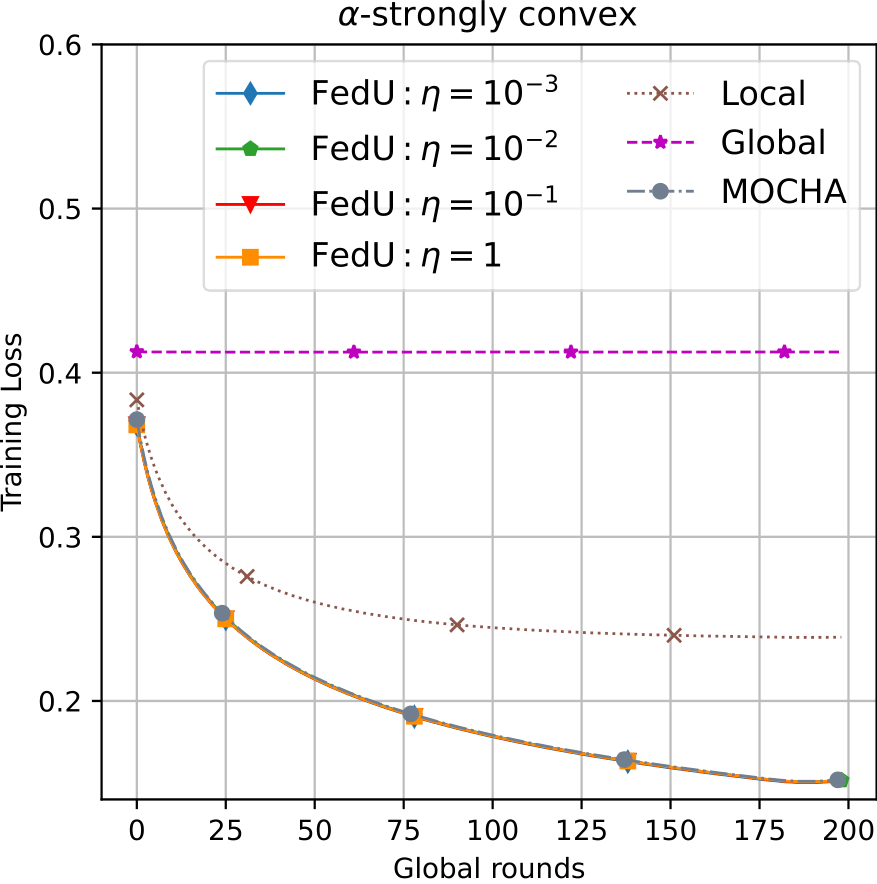

# Comparison of FMTL methods with conventional (global) Fl and personalized FL methods (local)

### Overview

#### The replication of experiments

#### Human Activity dataset, convex case

   

#### Human Activity dataset, non-convex case

   

#### Vehicle Sensor dataset, convex case

   

#### Vehicle Sensor dataset, non-convex case

   

### Plots comparison

   
