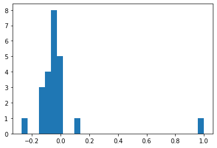

# Comparison of FMTL methods with conventional (global) Fl and personalized FL methods (local)

### Overview

Mobile phones, wearable devices, and smart homes are just a few of the modern distributed networks
generating massive amounts of data each day. Due to the growing storage and computational
power of devices in these networks, it is increasingly attractive to store data locally and push more
network computation to the edge.  Examples of potential applications include: learning sentiment,
semantic location, or activities of mobile phone users; predicting health events like low blood sugar
or heart attack risk from wearable devices; or detecting burglaries within smart homes.

#### The replication of experiments

In this repository are presented replication and new results of two articles:

1. Dinh, C. T., Vu, T. T., Tran, N. H., Dao, M. N., & Zhang, H. (2022). A new look and convergence rate of federated multitask learning with laplacian regularization. IEEE Transactions on Neural Networks and Learning Systems.
2. Smith, V., Chiang, C. K., Sanjabi, M., & Talwalkar, A. S. (2017). Federated multi-task learning. Advances in neural information processing systems, 30.

#### Human Activity dataset, convex case

   

#### Human Activity dataset, non-convex case

   

#### Vehicle Sensor dataset, convex case

   

#### Vehicle Sensor dataset, non-convex case

   

### Plots comparison

Why the global model is better in comparison to the personalized model and FMTL framework?
Human data is more iid distributed, while Vehichle Sensor data is highly skewed:

| Human Activity| Vehicle Sensor dataset |
| (random feature distribution)| (random feature distribution) |
| ------------- | ------------- |
|   |   |

### New matrix initialization results

To improve the results we suggest an initialization matrix of similarity based on the clients' data in the file our_matrix.py. It is calculated as follows:

1. Calculate class distribution for each task (train labels): {0 : 71, 5 : 37, 4 : 40, 2 : 37, 3 : 35, 1 : 40}
2. Normalize it: {0 : 0.27,5 : 0.14,4 : 0.15,2 : 0.14,3 : 0.13,1 : 0.15}
3. Calculate cosine similarity between vectors of the tasks → obtain α_{k,l}

   

